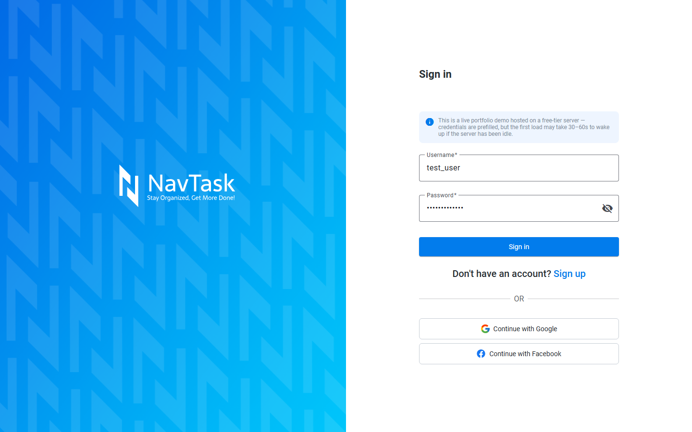
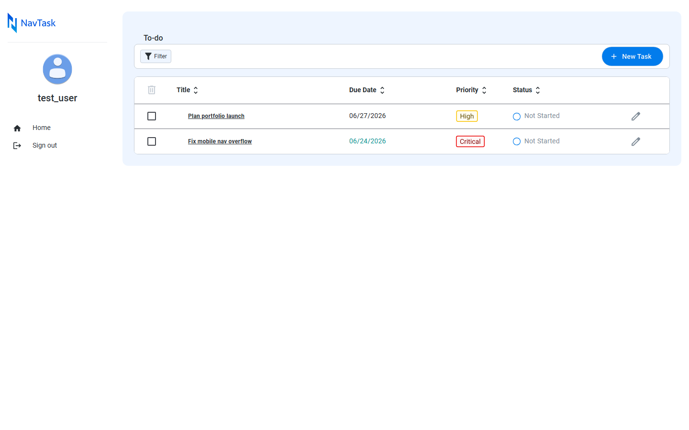
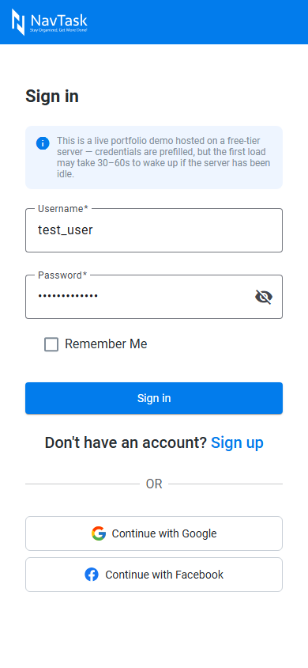
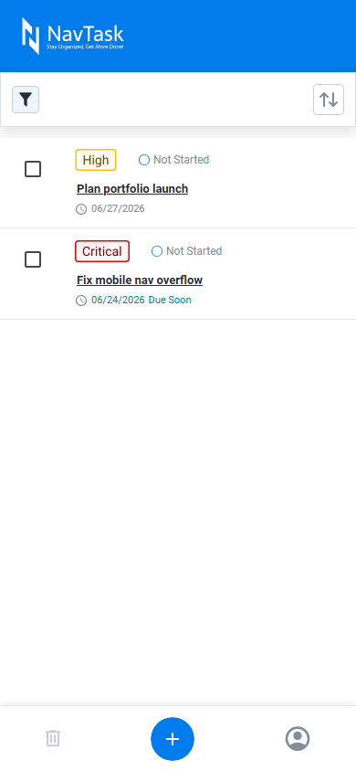

<a id="readme-top"></a>

<div align="center">
  <h3 align="center">NavTask</h3>

  <p align="center">
    A full-stack todo / task-management application built with Angular, NgRx, Spring Boot, and PostgreSQL.
    <br />
    <br />
    <a href="https://todoapp-client-i8uq.onrender.com" target="_blank">🚀 Live Demo</a>
  </p>
</div>
<p align="center">⚠️ <strong>Note:</strong> This application is deployed on <strong>Render (free tier)</strong>.
 Initial requests may take 30–60s due to server cold starts.</p>

---

## Table of Contents

<details>
  <summary>Table of Contents</summary>
  <ol>
    <li><a href="#about-the-project">About The Project</a></li>
    <li><a href="#tech-stack">Tech Stack</a></li>
    <li><a href="#project-structure">Project Structure</a></li>
    <li><a href="#getting-started">Getting Started</a></li>
      <ul>
        <li><a href="#prerequisites">Prerequisites</a></li>
        <li><a href="#installation">Installation</a></li>
      </ul>
    <li><a href="#demo-account">Demo Account</a></li>
    <li><a href="#responsive">Responsive Design</a></li>
    <li><a href="#screenshots">Screenshots</a></li>
    <li><a href="#learning-goals">Learning Goals</a></li>
    <li><a href="#roadmap">Roadmap</a></li>
    <li><a href="#license">License</a></li>
    <li><a href="#author">Author</a></li>
  </ol>
</details>

---

## <a id="about-the-project"></a> About The Project

**NavTask** is a full-stack task-management application that lets users create, organize, and track todos with priorities, statuses, subtasks, and file attachments. Users sign up or sign in (via username/password or Google/Facebook OAuth2), then manage their own private task list through a JWT-secured, cookie-based session.

This project was built as a learning-focused and showcase-driven full-stack application, designed to deepen and demonstrate knowledge of Angular, RxJS, and NgRx on the frontend, alongside a Spring Boot + Spring Security backend with PostgreSQL for persistence. It emphasizes reactive data flows, optimistic-vs-deferred state updates, authentication/authorization, and real-world deployment concerns (CORS, cookies, cold starts, zoneless change detection).

**✨ Key features:**

- ✅ Create, edit, delete, and bulk-delete todos
- 🗂️ Priority (Low / High / Critical) and status (Not Started / In Progress / Completed / Cancelled) tracking
- 📝 Subtasks with completion tracking — status can't be marked "Completed" until every subtask is done
- 📎 File attachments per todo, uploaded/removed locally and only synced to the backend on Save
- 🔐 Username/password authentication with a JWT stored in an httpOnly cookie
- 🌐 OAuth2 login via Google and Facebook (server-side redirect flow)
- 🧪 Prefilled demo account for visitors — no signup required
- ⏳ Loading states on save/delete/logout, with a shared full-screen overlay for auth transitions
- 📱 Fully responsive — dedicated mobile nav/filter/header components, not just breakpoint CSS
- 🔍 Filtering and sorting on the todo list

<p align="right">(<a href="#readme-top">back to top</a>)</p>

---

## <a id="tech-stack"></a> 🛠️ Tech Stack

**Frontend**


<br>

**Backend**


<br>

**Infrastructure**


<p align="right">(<a href="#readme-top">back to top</a>)</p>

---

## <a id="project-structure"></a> 📂 Project Structure

**Frontend**
```sh
frontend/
└── src/
    ├── app/
    │   ├── features/
    │   │   ├── auth/                # register / login / OAuth2 callback
    │   │   └── todos/                # list, detail, form, filters
    │   │
    │   ├── shared/components/        # mobile-nav, file-uploader, toast,
    │   │                             # loading-overlay, confirm-dialog, etc.
    │   ├── layouts/main-layout/
    │   ├── guards/                   # auth.guard, no-auth.guard
    │   ├── interceptors/             # auth.interceptor (withCredentials)
    │   ├── services/                 # auth, todo, toast services
    │   ├── store/                    # NgRx (actions, reducers, effects, selectors)
    │   ├── models/
    │   ├── pipes/
    │   └── environment/
    │
    └── styles/                       # design tokens, utils, overrides
```

**Backend**
```sh
backend/
└── src/main/java/com/backend/backend/
    ├── config/        # SecurityConfig, JwtFilter, CookieUtil, OAuth2SuccessHandler
    ├── controller/     # TodoController, UserController
    ├── service/         # TodoService, JwtService, OAuth2UserService, FileStorageService
    ├── entity/          # Todo, SubTask, TodoAttachment, User
    ├── dao/             # Spring Data JPA repositories
    ├── dto/
    └── enums/           # Priority, Status
```

<p align="right">(<a href="#readme-top">back to top</a>)</p>

---

## <a id="getting-started"></a> 🚀 Getting Started

### <a id="prerequisites"></a> Prerequisites

- Node.js (v20+) and npm
- Java 21
- PostgreSQL (local or hosted)
- A Google and/or Facebook OAuth2 client (only needed if you want social login locally)

### <a id="installation"></a> ⚙️ Installation

**1️⃣ Clone the repository**
```sh
git clone https://github.com/Zeras12314/todoApp.git
cd todoApp
```

**2️⃣ Backend setup**
```sh
cd backend
```
Create a `.env` file inside `backend/` (or set these as real environment variables):
```sh
DATASOURCE_URL=jdbc:postgresql://localhost:5432/todoapp
DATASOURCE_USER=your_postgres_user
DATASOURCE_PASSWORD=your_postgres_password

FRONTEND_URL=http://localhost:4200
BACKEND_URL=http://localhost:8080

# Google / Facebook OAuth2 (optional — only needed for social login)
spring.security.oauth2.client.registration.google.client-id=...
spring.security.oauth2.client.registration.google.client-secret=...
spring.security.oauth2.client.registration.facebook.client-id=...
spring.security.oauth2.client.registration.facebook.client-secret=...
```
Then run:
```sh
./mvnw clean package
./mvnw spring-boot:run
```
Backend runs at `http://localhost:8080`.

**3️⃣ Frontend setup**
```sh
cd ../frontend
npm install
npm start
```
Frontend runs at `http://localhost:4200`.

> **Note:** the frontend's API base URL is currently a hardcoded constant in `src/app/environment/env.ts` rather than a build-time environment variable — point it at your local backend if you're not using the deployed one.

<p align="right">(<a href="#readme-top">back to top</a>)</p>

---

## <a id="demo-account"></a> 🔑 Demo Account

The [live demo](https://todoapp-client-i8uq.onrender.com) comes prefilled with a demo account so you can sign in immediately, no signup required:

```sh
Username: test_user
Password: test_password
```

<p align="right">(<a href="#readme-top">back to top</a>)</p>

---

## <a id="responsive"></a> 📱 Responsive Design

- Dedicated mobile components (bottom nav, mobile header, mobile filter sheet) rather than just CSS breakpoints on the desktop layout
- Touch-friendly bottom-sheet pickers for status/priority on small screens
- Full-bleed mobile card list with safe horizontal-overflow handling

<p align="right">(<a href="#readme-top">back to top</a>)</p>

---

## <a id="screenshots"></a> 📸 Screenshots

<p>
  
</p>
<p>
  
</p>
<p>
  
  
</p>

<p align="right">(<a href="#readme-top">back to top</a>)</p>

---

## <a id="learning-goals"></a> 🧠 Learning Goals

This project was built to practice:

- Full-stack architecture with a clear frontend/backend boundary
- NgRx state management — actions, reducers, effects, and selectors for real async flows
- Deferred vs. optimistic UI updates (e.g. attachment changes only persist on Save, not on every interaction)
- JWT + httpOnly cookie authentication, and the CORS/cookie implications of a separately-hosted frontend and backend
- OAuth2 "Authorization Code" flow via Spring Security, end to end
- Building correctly under **zoneless Angular** — change detection has to be driven deliberately (signals, `markForCheck`, `async` pipe) rather than assumed
- Responsive, mobile-first UI design with dedicated mobile components

<p align="right">(<a href="#readme-top">back to top</a>)</p>

---

## <a id="roadmap"></a> 🗺️ Roadmap / Improvements

- 🔍 Advanced search & filtering
- 🧭 User profile management
- 🧪 Unit & e2e test coverage
- 💾 Persistent file storage (current attachment storage is ephemeral on Render's free tier)
- 🌐 Internationalization (i18n)

<br>

## <a id="license"></a> 📄 License

This project is for educational and portfolio purposes.

<br>

## <a id="author"></a> 👤 Author

<strong>Gerson Tiongson</strong>

<p>Angular Developer | Full-Stack Learner</p>

📧 **Email:** tiongsongerson@gmail.com
<br>
💼 **LinkedIn:** https://www.linkedin.com/in/gerson-tiongson/

<p align="right">(<a href="#readme-top">back to top</a>)</p>
